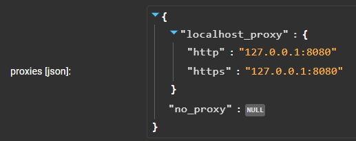
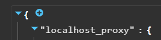
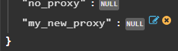
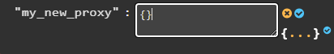
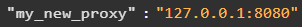
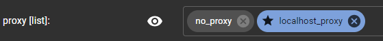

# URLDownloader Service
Assemblyline service that downloads seemingly malicious URLs using MAS' Kangooroo utility

# Kubernetes VS Docker deployment
In Kubernetes, there is a chance that you do not need to configure the no_sandbox option. If you are executing URLDownloader in a docker-compose setup, and have problem with it always finishing with an error (TimeoutExpired), you can change the "no_sandbox" service variable from the default False to True. This option will be passed on to the google-chrome process and may resolve your issue.

Service variables are found under the Administration tab, in the Services item. More information on service management can be found in our documentation and more specifically [here](https://cybercentrecanada.github.io/assemblyline4_docs/administration/service_management/#service-variables) for service variables.

# How to configure a proxy
The URLDownloader service can be configured to use many proxies (or not) and allow the submitting user to pick from a choice. If you want to force a proxy, you can also have a single entry in the list of choices, and that will make it mandatory. URLDownloader does not rely on the system configuration because we have situations where we have multiple proxies and want to fetch content from different places. It could also happen that the proxies from which we want to fetch be different be different from the proxy used by the rest of the system.

You can configure the URLDownloader service by going to the list of services, and clicking on URLDownloader (or going to `/admin/services/URLDownloader` directly). You should find a tab named `PARAMETERS`. Two parameters are important, the first one being `proxies [json]` and the second being `proxy [list]`. It is easier to understand their relationship by starting with the `proxies [json]`, which should be found under the service variables toward the bottom of the page.

You can create new entries based on the following pattern:

To edit a json in the web interface, you can hover on the json, a blue plus sign should appear toward the top:

This will allow you to create a new key. By hovering on the new key, you should be able to edit it:

You can then type in `{}` and click on the new dictionary button (bottom right in the next screenshot):

You should now be able to add two new keys, for http and https.

TIP: If you want to use the same proxy for all schemes (http/https), you can use a simple string:

After configuring the service proxies, you can look toward the top, under User Specified Parameters, there should be `proxy [list]`.

You will be able to add the name of the key you added (`my_new_proxy` in this example) so that the users can select it.
The entry with a star is going to be the default selection if a user does not configure it. You can delete all other entries from here to force a single one.
